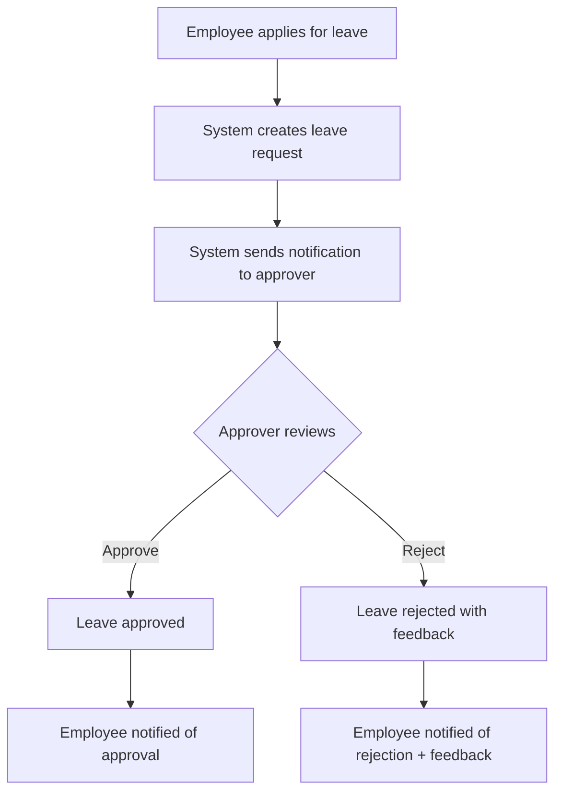

# Leave Application & Approval Workflow

## Overview
A complete leave management system where employees can apply for leave, receive notifications, and supervisors can approve/reject with feedback.

## Current State
- `leaves` table exists with basic fields (user, leave_type, dates, status)
- `leave_types` table defines types of leave available

## Proposed Workflow

## Data Model Changes

### 1. Update `leaves` table
- Add: `requester_id` (BIGINT) - who applied
- Add: `approver_id` (BIGINT) - who approved/rejected  
- Add: `approved_at` (TIMESTAMPTZ) - when approved
- Add: `reviewer_feedback` (TEXT) - comments from approver
- Keep: `status` (pending/approved/rejected)

### 2. Create `leave_approvers` table (optional - for multi-level)
- `leave_type_id` → which leave types
- `approver_role_id` → who can approve
- `approval_level` → 1 (manager), 2 (HR), etc.

### 3. Enhance `notifications` table
- Already exists, but ensure it can link to leave requests
- Add: `reference_type` = 'leave_request'
- Add: `reference_id` = leave.id

## API Endpoints Needed

| Method | Endpoint | Description |
|--------|----------|-------------|
| POST | `/leaves` | Apply for leave |
| GET | `/leaves` | List my leave requests |
| GET | `/leaves/pending` | List pending approvals (for approvers) |
| GET | `/leaves/:id` | Get leave details |
| PUT | `/leaves/:id/approve` | Approve leave request |
| PUT | `/leaves/:id/reject` | Reject with feedback |

## Frontend Components

1. **MyLeaveRequestsPage** - View own leave history
2. **ApplyLeaveForm** - Submit new leave request  
3. **PendingApprovalsPage** - For supervisors to see requests needing action
4. **LeaveApprovalForm** - Review and approve/reject with comments

## Implementation Plan

1. **Database**: Update `leaves` table with new columns
2. **Backend**: Add approval endpoints to leaves service
3. **Frontend**: Create approval UI components
4. **Notifications**: Trigger on status change

Would you like me to proceed with implementing this workflow?